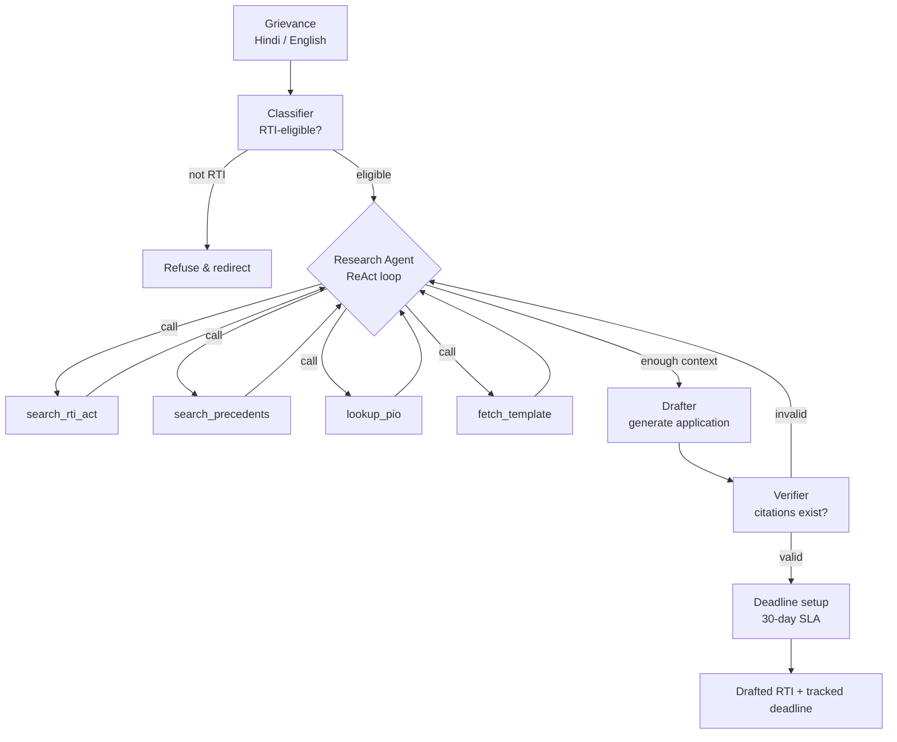
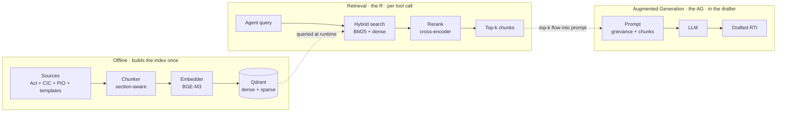

# Architecture — RTI Drafting Agent

An agentic RAG system that turns a plain-language grievance into a legally sound Right to Information (RTI) application, grounded in the RTI Act 2005 and Central Information Commission (CIC) precedents.

This document captures the system design, the reasoning behind each decision, and what's deliberately out of scope. It's the anchor for everything in the repo — if a code choice conflicts with what's written here, either the code is wrong or this doc needs an update.

---

## 1. Problem

The Right to Information Act, 2005 gives every Indian citizen the right to ask a public authority for information and receive a response within 30 days. In practice, most citizens who *should* file an RTI don't, because the filing process has non-obvious friction:

- **Which department?** A "PF withdrawal stuck" grievance could sit with EPFO central, a regional office, or the employer's establishment code.
- **Which section?** Section 6 governs filing, 7(1) governs response times, 8 lists exemptions the PIO will hide behind. Getting the sections wrong invites a denial.
- **Which precedents help?** CIC decisions are public but not searchable in any useful way. A citizen has no way to know that in 2022 a near-identical grievance succeeded when the applicant cited a specific CIC ruling.
- **Language mismatch.** The Act and the decisions are in legal English; grievances are in colloquial Hindi, English, or code-mixed. Translation loses precision.

The result is that RTI, one of the strongest transparency instruments in India, is used disproportionately by activists and journalists who've built up the tacit knowledge over years. Ordinary citizens with legitimate grievances either don't file, or file weak applications that get denied.

**Who this is for.** Any Indian citizen with a grievance against a central government authority. The system produces a draft application; the user reviews, edits, and files it themselves.

**What "good" looks like.**
- The draft cites real sections of the RTI Act, not hallucinated ones.
- It cites real CIC precedents that support the request, when relevant.
- It targets the correct PIO for the correct authority.
- It's phrased to preempt likely Section 8 exemption denials.
- The user gets a deadline reminder before the 30-day clock runs out.

**What "good" is not.**
- Automated filing. The user files it themselves.
- Legal advice. The system drafts a request for information; it does not advise on litigation, appeals strategy, or rights beyond RTI.

---

## 2. System overview

At the top level, the system is a pipeline with an agent embedded inside it. The pipeline stages are deterministic; the agent, which sits in the middle, plans its own retrieval strategy per grievance.

### Component walkthrough

**Classifier** — a small, cheap LLM call that decides whether the grievance is actually an RTI matter. Many grievances aren't: they're service complaints (should go to the consumer helpline), private disputes (civil court), or matters already sub judice (RTI won't help). Refusing correctly is a feature; it saves the user from filing something that will bounce back and wastes no downstream tokens.

**Research Agent** — the interesting part. A ReAct-style loop (Reason → Act → Observe) that plans which tools to call and when it has enough context. Given a grievance, it decides:

- Which sections of the Act are relevant.
- Whether precedents exist that support the request.
- Which PIO is the correct target.
- Whether a matching template exists to structure the draft.

The agent's tools are the four `search_*` / `lookup_*` / `fetch_*` functions. Each tool is a bounded operation with a typed input and output; the agent picks which to call, with what query, in what order.

**Drafter** — a single LLM call that takes the accumulated context (retrieved sections, precedents, PIO details, templates) and generates the RTI application in the user's chosen language.

**Verifier** — a separate node that checks every citation in the draft against the corpus. If the draft cites "CIC Decision X v Y (2019)" or "Section 8(2)(a)", the verifier looks each one up in Qdrant. Invalid citations trigger a return to the research agent with structured feedback ("Section 8(2)(a) does not exist; the closest real citation is Section 8(1)(a)"). Retries are bounded to two; after that the draft ships with a "citations unverified" flag.

**Deadline setup** — writes a `deadline_at = filed_at + 30 days` record to Postgres, hooks up a reminder job. This is boring plumbing, but it's part of the value proposition: the citizen shouldn't have to remember when to escalate to a First Appeal.

### What's not in the diagram

Three layers sit above and below what's shown; they're deliberately omitted because they're plumbing, not design:

- **Client** — Next.js web app calls the FastAPI backend. A WhatsApp channel (via Meta Cloud API) can hit the same endpoint later.
- **API layer** — FastAPI with a single `POST /draft` endpoint. Streams tokens via SSE so the user sees progress on a slow agent loop.
- **LLM providers** — Drafter uses a frontier model (Claude Sonnet or GPT-4-class); classifier uses a cheap model (Haiku, GPT-4o-mini, or Llama-3 on Groq). Providers sit behind a thin interface so we can swap and benchmark.

---

## 3. Where RAG lives

RAG in this system isn't one component — it's three phases spread across the pipeline. Understanding where each phase lives makes the rest of the code easier to navigate.

**Offline (grey)** — runs once when we build the index and again when the corpus changes. Chunks the raw sources, embeds with BGE-M3, writes to Qdrant collections. This is the `app/ingestion/` module.

**Retrieval, the "R" (teal)** — happens inside every agent tool call. When the agent calls `search_precedents(...)`, that call executes this row: embed the query, run hybrid search against Qdrant, rerank the top 20, return the top 5 chunks with metadata. Every tool call = one execution of this row. This is the `app/retrieval/` module.

**Augmented Generation, the "AG" (purple)** — happens inside the drafter node. All the chunks the agent accumulated across its research loop get concatenated into a prompt with the original grievance, and the LLM generates the final application. This is the `app/agent/drafter.py` node.

### Why "agentic RAG" is the accurate label

Classical RAG retrieves once, up front, with a fixed query: `query → retrieve → generate`. One R, one AG. This works when the query and the corpus align well; it fails when the right retrieval depends on reasoning the LLM can only do after reading the input.

Agentic RAG retrieves N times, with queries the LLM plans as it goes. In this system, a typical grievance triggers 3–6 tool calls before the agent decides it has enough context. Only then does the single AG (drafter) fire.

The interview-defensible sentence: *"Instead of retrieving once from a fixed query, the research agent plans its retrieval strategy per grievance, executes 3–6 targeted retrievals, then generates a grounded draft. A verifier agent enforces citation validity by looping back to the researcher when it finds ungrounded citations."*

### The verifier's role in the RAG picture

The verifier does its own tiny R (looks up each cited section and case in Qdrant to confirm existence), but no AG — it returns a pass/fail with the list of invalid citations. So it's "R without AG," which is why calling the system "RAG + agent" is accurate: R happens in tools and in the verifier; AG happens once, in the drafter.

---

## 4. Key design decisions

Each of these was picked over defensible alternatives. Every entry is short: decision → why → cost.

### 4.1 LangGraph over ReAct-only agents or CrewAI

**Decision.** LangGraph is the orchestration layer. Nodes are explicit; edges are typed; the state machine is legible.

**Why.** A pure ReAct loop is fine for exploratory tasks but makes control flow implicit. Multi-agent frameworks like CrewAI add role-play abstractions that obscure what's actually happening. RTI drafting is a known-shape workflow with one embedded agent — an explicit graph is easier to trace, debug, and reason about in interviews.

**Cost.** More upfront code than a bare ReAct loop. Worth it for the traceability.

### 4.2 Separate Qdrant collections per corpus

**Decision.** Four collections: `rti_act`, `cic_precedents`, `pio_directory`, `templates`. Not one big collection.

**Why.** Each corpus has a different chunking strategy, metadata schema, and retrieval pattern. Statutory text chunks by section with metadata `{section, subsection, topic}`. Case law chunks by paragraph with `{case_id, department, outcome, sections_invoked}`. The PIO directory is structured records, not really RAG. Forcing them into one collection loses filter precision and makes hybrid weighting harder.

**Cost.** More ingestion code and slightly more retrieval code. Trade well made — every serious RAG system ends up with multiple collections.

### 4.3 BGE-M3 for embeddings

**Decision.** BAAI's BGE-M3 for dense embeddings, run locally via `sentence-transformers`.

**Why.** Three properties matter for this system:
- **Multilingual.** RTI grievances arrive in Hindi, English, and heavy code-mixing. OpenAI's `text-embedding-3` is weaker on Hindi than BGE-M3 in published benchmarks.
- **Dense + sparse in one model.** BGE-M3 emits both a dense vector and a sparse (lexical) vector from a single forward pass. This maps directly onto Qdrant's hybrid search.
- **Local.** No per-query API cost. Ingestion embeddings amortize once; query embeddings are effectively free at inference time.

**Cost.** Larger model (~2 GB) than a hosted embedding API. Adds ~200 ms cold-start latency per query on CPU. Acceptable given the offline majority of work.

### 4.4 Hybrid retrieval with cross-encoder rerank

**Decision.** Every tool call runs: BM25 (sparse) + dense retrieval → merge top 20 → cross-encoder rerank → top 5.

**Why.** Exact citations ("Section 8(1)(j)") need lexical match; BM25 nails this. Grievance-to-precedent similarity is semantic; dense retrieval wins here. Merging catches both. Reranking with a cross-encoder (BGE-reranker-v2-m3) then reorders the top 20 with much better precision than either method alone — this single step typically moves relevance more than any embedding upgrade would.

**Cost.** Two searches instead of one, plus a rerank call. Adds ~300 ms per tool call. Worth it for grounding quality.

### 4.5 Verifier as a separate node, not a self-check prompt

**Decision.** After the drafter generates, a distinct verifier node parses out citations and validates each one against Qdrant. If any fail, control goes back to the research agent with structured feedback.

**Why.** Self-check inside the drafter's own prompt ("check your citations before finalizing") fails silently — the model rationalizes wrong citations and moves on. A separate node with programmatic corpus lookup can't be talked out of a "citation not found" verdict. It's not about model capability; it's about separating generation from verification so the verifier is grounded in facts, not the drafter's reasoning.

**Cost.** One extra node, one extra retrieval pass, and a bounded retry loop. Adds up to 2× drafter cost in the worst case. Bounded to two retries so latency is capped.

### 4.6 Central RTI Act only for v1

**Decision.** v1 covers the Central RTI Act and central government authorities only. No state RTIs, no consumer forums.

**Why.** Every state has its own RTI rules (fee, format, appellate authority), and covering them multiplies the corpus and testing burden by 30×. Central covers a large enough user base to prove the design. State expansion is a v2 scope decision, not a v1 blocker.

**Cost.** Users with state-level grievances (a lot of them) aren't served in v1. The system should refuse cleanly and tell them why, rather than pretend to help.

### 4.7 Streamlit deferred; Next.js frontend

**Decision.** v1 ships with a Next.js frontend, not Streamlit.

**Why.** This is a portfolio project. A polished web UI photographs better for the CV, matches what a real product would look like, and forces a proper API boundary (which Streamlit would let us skip). The extra frontend work is a few days.

**Cost.** More frontend code. Streamlit would have been faster for pure iteration.

---

## 5. Non-goals

The system deliberately does not:

- **Give legal advice.** Every draft carries a visible disclaimer: this is a drafting aid, not legal counsel. When the classifier detects a grievance that's really about litigation, appeals, or rights that don't map to RTI, it refuses and redirects.
- **File on the user's behalf.** No automated submission to government portals. The user reviews and files themselves. This keeps the system out of the loop for anything the user hasn't consented to explicitly.
- **Cover state RTIs in v1.** See 4.6.
- **Fine-tune any model.** All grounding is at the RAG layer, not the weights. Fine-tuning on a small, legally sensitive corpus is a research project, not a portfolio project.
- **Store personal grievance data long-term.** Grievances often contain sensitive personal details. v1 retains only what's needed to serve the deadline reminder; anything beyond a user-set retention window is purged.
- **Optimize for cheapest possible LLM usage.** Cost matters, but grounding matters more. The design accepts 4–8 LLM calls per grievance as the price of an actual agent.

---

## 6. Roadmap

### v1 — the current build

Everything in this document. Ships when:

- Ingestion pipeline builds the four Qdrant collections cleanly and reproducibly.
- The agent loop, drafter, and verifier work end-to-end on a held-out eval set of ≥50 real grievances.
- The frontend is polished enough to demo and screenshot.
- The repo has a written eval report with numbers, not vibes.

### v2 — after v1 ships

- **State RTI support.** Start with one state (likely Uttar Pradesh — high volume, familiar terrain), then generalize.
- **First Appeal drafting.** If the PIO denies or ignores the RTI, the same system drafts the First Appeal citing the denial letter and precedent.
- **Consumer Protection Act complaints.** A parallel corpus and set of tools for grievances that aren't RTI-shaped. The classifier would route.

### v3 — production or bust

- **WhatsApp deployment** via Meta Cloud API. Real users, real usage numbers.
- **A/B evals** on prompt and retrieval changes with real production traffic.
- **Structured feedback loop** — the citizen tells us whether the RTI they filed succeeded, and that signal feeds back into precedent scoring.

---

## Appendix — References

- Right to Information Act, 2005 — full text at rti.gov.in
- CIC decisions archive — cic.gov.in
- LangGraph docs — for the state machine patterns used in `app/agent/`
- BGE-M3 paper — Chen et al. 2024, for the embedding choice
- Qdrant hybrid search docs — for the BM25 + dense implementation
